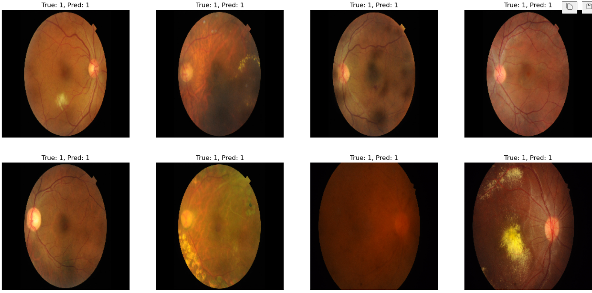

# DeepLearning-Recognition-of-Healthy-and-Unhealthy-Retinal-Optic-Disc-Image
Project that recognizes whether the optic disc is healthy or unhealthy by looking at the retina optic disc image

In this project, the data set was taken from kaggle.com(https://www.kaggle.com/datasets/andrewmvd/retinal-disease-classification)

In the output example you will see after compiling the project:

